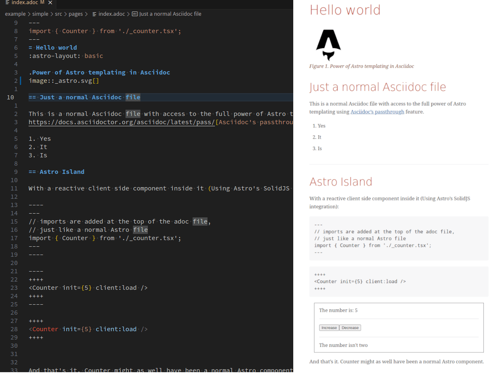

# @sransara/astro-adocx
Like MDx, but for Asciidoctor in Astro using passthroughs.



## Sample adoc file
```adoc
---
import { Counter } from './_counter.jsx';
---
= Hello, World!

This is a sample Asciidoc file.

Here is a counter:
++++
<Counter init={5} client:load />
++++

Built with +++{Astro.generator}+++
```

## Installation
```bash
npm install @sransara/astro-adocx
```

And add the plugin to your `astro.config.js`:

```js
import { adocx } from '@sransara/astro-adocx/integration';

const  { adocxConfig, asciidoctorConfig } = ...; // sample configs can be found in the `examples` directory

export default {
  plugins: [
    adocx(adocxConfig, asciidoctorConfig)
  ]
}
```

